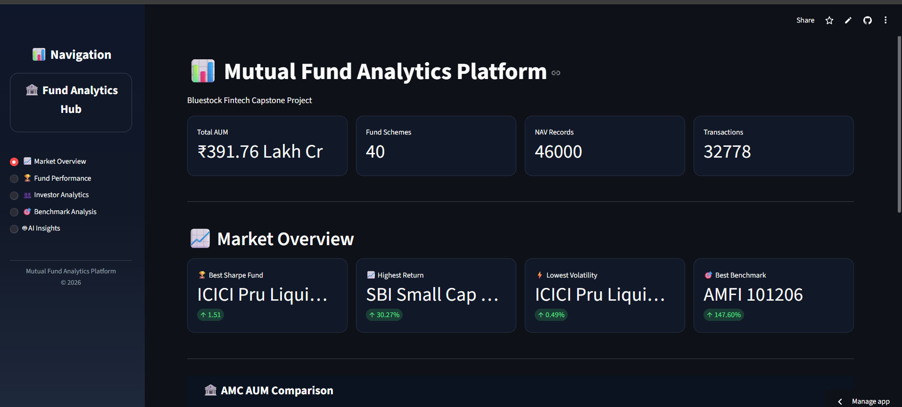
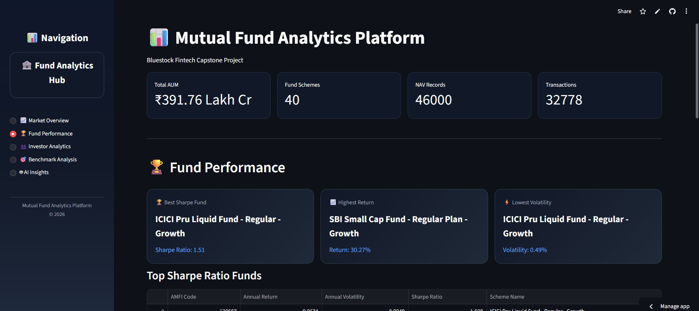
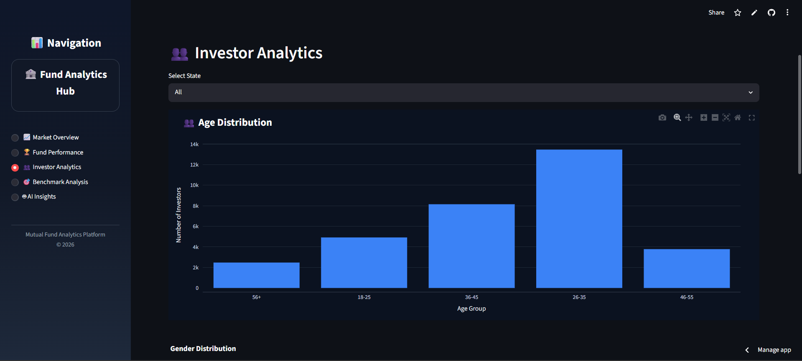
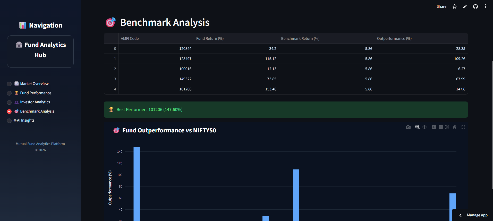

# 📊 Mutual Fund Analytics Platform

An AI-Powered Mutual Fund Analytics Dashboard built using Streamlit, SQLite, Pandas, and Plotly for analyzing mutual fund performance, investor behavior, benchmark comparison, and risk-adjusted returns.

## 🚀 Live Demo

Live Application:
https://mutual-fund-analytics-platform-mneptuyahvrdbn55d3uzzh.streamlit.app/

GitHub Repository:
https://github.com/Pothuraju1690/mutual-fund-analytics-platform

---

## 📌 Project Overview

The Mutual Fund Analytics Platform is a comprehensive fintech analytics solution developed to provide insights into mutual fund performance and investment behavior.

The platform processes large-scale mutual fund datasets and presents interactive dashboards for performance tracking, benchmark evaluation, investor analytics, and AI-driven recommendations.

---

## ✨ Key Features

### 📈 Market Overview

* Total Assets Under Management (AUM) Analysis
* Fund House Distribution
* Category-wise Fund Analysis
* Interactive KPI Cards
* Market Summary Dashboard

### 🏆 Fund Performance Analysis

* Annual Return Analysis
* Sharpe Ratio Rankings
* Risk-Adjusted Performance Metrics
* Top Performing Fund Identification
* Volatility Analysis

### 👥 Investor Analytics

* Investor Transaction Analysis
* SIP Inflow Trends
* Portfolio Distribution Insights
* Investor Behavior Visualization
* Transaction Volume Analytics

### 🎯 Benchmark Analysis

* Benchmark vs Fund Performance
* Alpha-Beta Evaluation
* Outperformance Tracking
* Comparative Performance Analysis
* Risk Benchmarking

### 🤖 AI Insights

* Best Risk-Adjusted Fund Detection
* Highest Return Fund Identification
* Lowest Volatility Fund Analysis
* Largest AMC Recognition
* Executive Investment Recommendation Engine

---

## 🛠️ Technology Stack

### Frontend

* Streamlit

### Backend

* Python

### Database

* SQLite

### Data Processing

* Pandas
* NumPy

### Visualization

* Plotly

### Analytics

* Financial Performance Metrics
* Sharpe Ratio Analysis
* Alpha-Beta Analysis
* Risk-Return Evaluation

---

## 📂 Project Structure

```text
MutualFundAnalytics/
│
├── dashboard_v2.py
├── mutual_fund.db
├── requirements.txt
├── README.md
│
├── data/
│   ├── raw/
│   └── processed/
│
├── reports/
│
├── sql/
│   └── schema.sql
│
└── screenshots/
```

## 📊 Dataset Coverage

* 40 Mutual Fund Schemes Analyzed
* ₹391.76 Lakh Crore Total AUM Covered
* 46,000+ NAV Records Processed
* 32,778 Investor Transactions Analyzed
* Multiple Fund Houses Included
* Benchmark Performance Data Integrated

---

## 📸 Project Screenshots

### Market Overview



### Fund Performance



### Investor Analytics



### Benchmark Analysis



---

## 📈 Financial Metrics Used

* Annual Return
* Annual Volatility
* Sharpe Ratio
* Alpha
* Beta
* Benchmark Outperformance
* Risk-Adjusted Return
* Portfolio Diversification Indicators

---

## 🎯 Business Impact

This platform enables investors, analysts, and financial institutions to:

* Identify high-performing mutual funds
* Compare benchmark performance
* Analyze investor behavior patterns
* Evaluate risk-adjusted returns
* Make data-driven investment decisions

---

## 🔮 Future Enhancements

* Real-Time NAV Integration
* Machine Learning-Based Fund Prediction
* Portfolio Recommendation System
* AMC Comparison Dashboard
* Investor Risk Profiling
* Automated Investment Suggestions
* Mutual Fund Chatbot Assistant

---

## 👨‍💻 Author

Pothu Raju

Developed as a FinTech Analytics Project using Python, Streamlit, SQLite, Pandas, and Plotly.

---

## 📜 License

This project is developed for educational and portfolio purposes.
